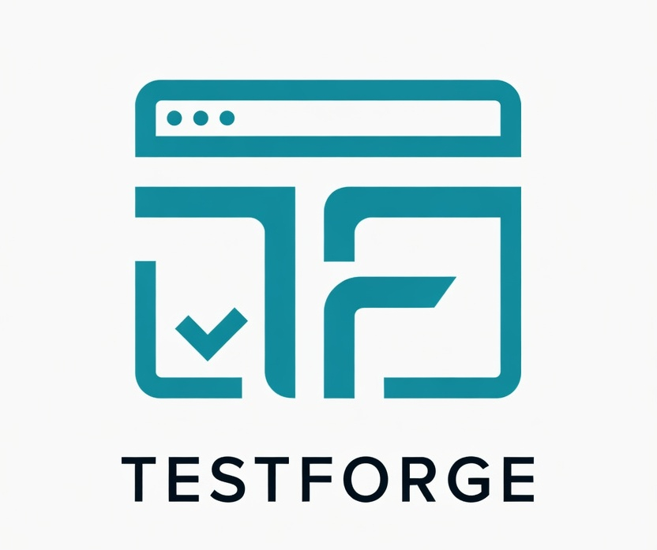

<p align="center">
  
</p>

# 🛠️ TestForge | Web Automation MCP Server

An advanced, autonomous AI tool designed for Model Context Protocol (MCP) clients (like Cursor, Anthropic Desktop, etc.). This server provides an suite of highly specialized endpoints that transform your LLM into a Staff-Level QA Automation Engineer.

It natively understands the **Playwright-BDD** testing framework, enforcing strict Page Object Model (POM) patterns, web-first assertions, and defensive coding techniques.

## 🚀 Key Capabilities

This MCP Server bridges the gap between AI code generation and deterministic framework execution. It provides your AI with tools to:

1. **Scaffold & Configure**: Setup Playwright-BDD, isolate `.env` credentials, and manage role-based testing.
2. **Code Generation & Dry Runs**: Generate tightly-coupled Gherkin `.feature` files and Playwright Page Objects with AI. Preview changes before writing to disk.
3. **Legacy Migration**: Automatically parse and translate Java/Python Selenium frameworks into modern TypeScript Playwright-BDD components.
4. **Self-Healing Mechanics**: Execute tests locally, analyze failures, scrape the live Page DOM (Accessibility AOM), and automatically correct broken selectors.
5. **Autonomous Learning**: Teach the AI custom heuristics (`// @mcp-learn`). The AI will permanently store and inject your team's custom rules into future code generations.
6. **CI/CD & Defect Tracking**: Scaffold GitHub Actions, GitLab CI, and Jenkins pipelines. Export formatted Atlassian Jira bug reports directly from test failures.

## 📚 Documentation & User Guides

Detailed documentation, examples, and exact prompts to use with your AI client are available in the `docs/` folder:

*   [**Setup & Configuration**](docs/SetupAndConfig.md) - Project initialization, `.env` management, and MCP user roles.
*   [**Test Generation & Refactoring**](docs/TestGeneration.md) - Context-aware BDD generation, dry runs, and codebase refactoring.
*   [**Migration Guide**](docs/MigrationGuide.md) - Porting Selenium (Java/Python) to Playwright.
*   [**Execution & Self-Healing**](docs/ExecutionAndHealing.md) - Running tests, interacting with the live DOM, and auto-healing locators.
*   [**Continuous Integration & Jira**](docs/ContinuousIntegration.md) - Generating CI/CD pipelines, exporting Jira bugs, and LCOV coverage gaps.
*   [**Team Collaboration & Autonomous Learning**](docs/TeamCollaboration.md) - Training the AI, `@mcp-learn` inline comments, and exporting the AI's internal knowledge base to your team.
*   [**E2E Testing Guide**](docs/E2ETestingGuide.md) - Step-by-step guide to test every feature as an end user.
*   [**Token Optimizer**](docs/TokenOptimizer.md) - Code Mode Execution for up to 98% token savings.

---

## 🛠️ MCP Tool Reference (Exposed Capabilities)

### **Project Setup & Maintenance**
* `setup_project`: Bootstraps a scalable framework with hooks and standard structure.
* `upgrade_project`: Updates an existing repository to latest core dependencies and migrates configurations.
* `manage_config`: Reads/updates `mcp-config.json` capability builds and developer routing.

### **Codebase Intelligence & Generation**
* `analyze_codebase`: AST-based extraction of existing Steps, Pages, and Helpers.
* `generate_cucumber_pom`: Heart of the machine. Generates the BDD suite instructions mapping English to POM code.
* `validate_and_write`: Syntactically validates TypeScript and Gherkin before committing writes safely to disk.
* `migrate_test`: Translates Selenium (Java/Python) into Playwright BDD TypeScript.

### **Execution & Healing**
* `inspect_page_dom`: Fetches the live Accessibility Tree to find 100% accurate locator roles and names.
* `run_playwright_test`: Executes native `npx bddgen && npx playwright test` and returns terminal logs.
* `self_heal_test`: Feeds failures and live DOM context into the LLM to patch broken step definitions.

### **Advanced Quality Assurance**
* `analyze_coverage`: Reports on missing core functional flows and negative tests.
* `export_bug_report`: Auto-classifies failures into Jira/Linear ready Markdown tickets with environment metadata.
* `suggest_refactorings`: Flags unused POM methods and Duplicate Step Definitions.

### **Token Optimization**
* `execute_sandbox_code`: 🆕 **TURBO MODE** — Execute JavaScript inside a secure V8 sandbox on the server for up to **98% token savings**. See [Token Optimizer docs](docs/TokenOptimizer.md).

## Getting Started

### 🔌 Bootstrapping the Server

Add the local server to your MCP Client settings:

```json
{
  "mcpServers": {
    "testforge": {
      "command": "node",
      "args": ["/absolute/path/to/playwright-bdd-pom-mcp/build/index.js"]
    }
  }
}
```

> [!TIP]
> This server also supports **SSE transport** via `--transport sse --port 3100`.

Then, simply open a chat and say: *"I have a new automation project located at /path/to/my/project. Please set up Playwright-BDD for me."*

*Designed for resilience, isolation, and enterprise-grade automation.*
