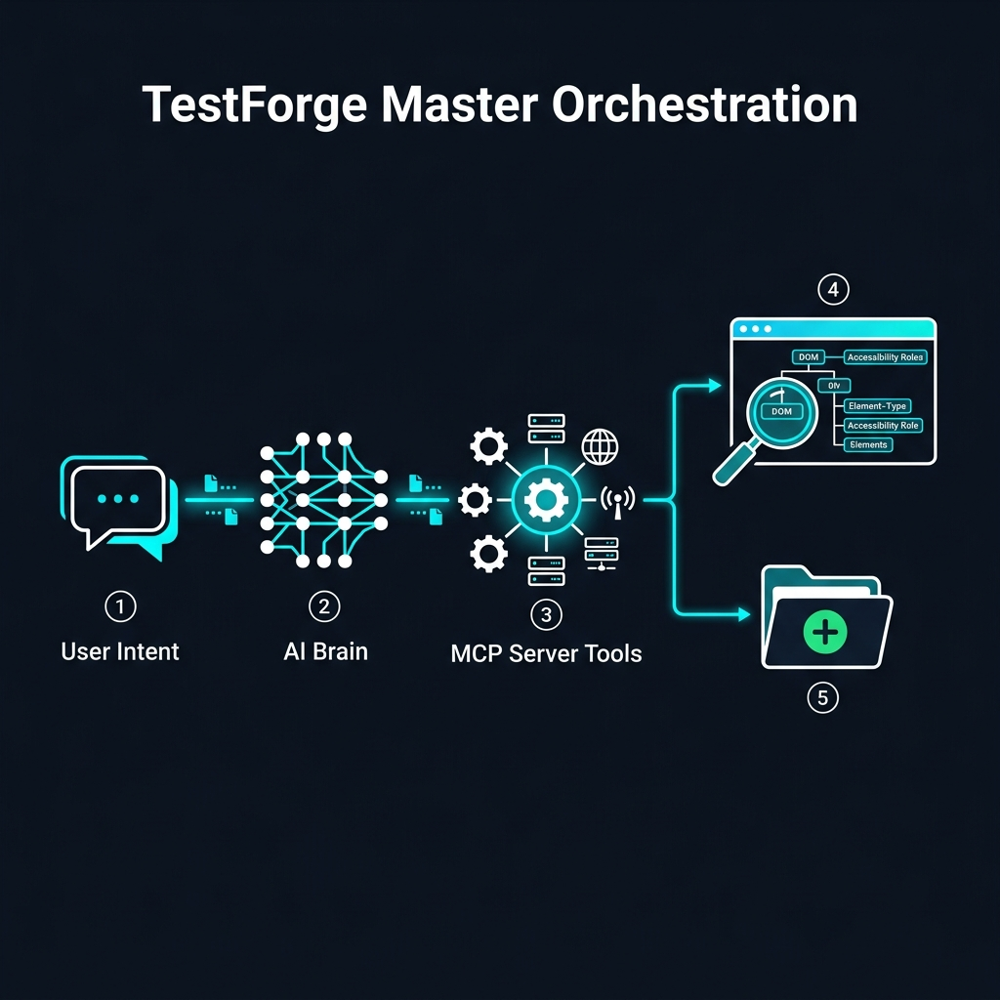

import { Card, CardGrid, Badge } from '@astrojs/starlight/components';

## 🧬 The Orchestration DNA

TestForge isn't just a library; it's a **Thinking Engine** for web automation.

<CardGrid>
	<Card title="Autonomous Healing" icon="heart">
		When selectors break, TestForge doesn't. It uses **Atomic Orchestration** to re-scan the live DOM, identify the updated Accessibility Role, and fix your source code in a single round-trip. No manual intervention required.
	</Card>
	<Card title="Turbo-Sandbox Analysis" icon="rocket">
		Achieve a **98% reduction in token usage**. Our local V8 engine processes massive DOM structures and codebase ASTs locally, sending only refined context to the LLM. 
	</Card>
	<Card title="Architectural Enforcement" icon="shield-check">
		TestForge is architecturally-aware. It mandates the **Page Object Model (POM)** pattern and prevents 'spaghetti code' by validating all generated logic against your project's custom structural brain.
	</Card>
	<Card title="Semantic Extraction" icon="magnifier">
		Built for stability. TestForge generates tests using **Accessibility Roles** (ARIA), making your automation resilient to visual CSS changes and DOM restructuring.
	</Card>
</CardGrid>

 

## 🛠️ Performance & Compliance

Built for the scale of enterprise teams.

<CardGrid stagger>
	<Card title="Zero-Config CI/CD" icon="rocket">
		Pre-built workflows for **GitHub Actions** and **GitLab**. Automated report capturing and DNA failure analysis out of the box.
	</Card>
	<Card title="Secure Execution" icon="shield">
		All sandbox operations run in an isolated, read-only memory space. Your local system and credentials stay protected.
	</Card>
	<Card title="Legacy to Modern" icon="document">
		Migrate entire suites from **Selenium, Cypress, or Detox** to Playwright-BDD with the `migrate_test` toolchain.
	</Card>
	<Card title="Multi-Environment Stores" icon="setting">
		Centralized user and credential management with environments-aware staging, production, and dev stores.
	</Card>
</CardGrid>

 

## High-Level Orchestration

 

:::tip[Ready to transform your QA?]
Join the future of orchestrated automation. TestForge is currently in early access for enterprise partners.
[Get Started Today](/TestForge/repo/user/userguide/)
:::

