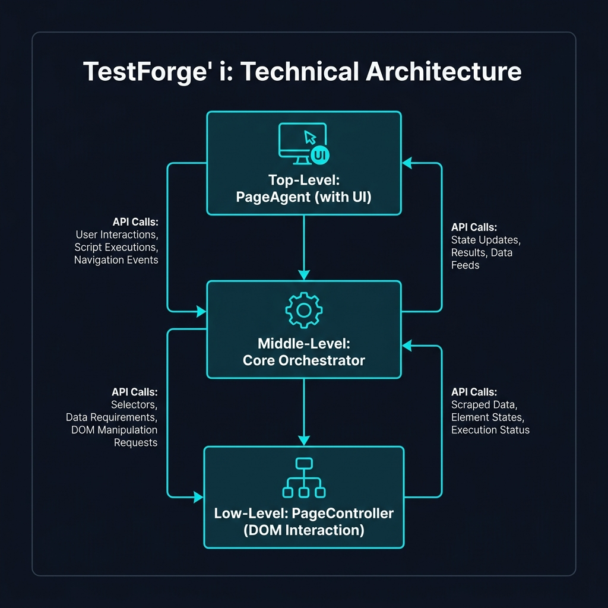

import { Steps, Badge, Card, CardGrid } from '@astrojs/starlight/components';

This document provides a technical map of the internal service boundaries that power TestForge. Unlike the high-level orchestration, this guide focuses on the **Package Interactions** that define our "Street-Smart" execution.

:::note[What you will learn]
- **Internal Modules**: The interface between `core`, `controller`, and `ui`.
- **The Adapter Pattern**: How we bridge Reasoning Engines (LLMs) to the Browser.
- **Service Registration**: How dependencies are injected via the `ServiceContainer`.
:::

---

## 🏛️ Internal Module Map
TestForge is built as a modular monorepo. This diagram illustrates the data flow between our primary code packages.

### 1. PageAgent (`packages/page-agent`)
The main entry point. It extends the headless core and injects the **UI Panel** components. This is what the human developer interacts with.

### 2. Core (`packages/core`)
The **Reasoning Orchestrator**. It manages the state machine, handles tool selection, and coordinates the "Heal & Verify" sequence. It imports from `@page-agent/llms`.

### 3. PageController (`packages/page-controller`)
The **Execution Engine**. This package has zero awareness of the AI. It purely handles DOM element extraction, simplification into Accessibility Trees, and raw browser actions (Click, Type, Scroll).

---

## 🔌 The "Reasoning-to-Execution" Bridge
TestForge acts as the 'Smart Adapter' between the Reasoning Engine (Claude/OpenAI) and the Execution Environment (Playwright).

| Layer | Responsibility | Communication Protocol |
| :--- | :--- | :--- |
| **Reasoning** | Plan generation and intention. | Natural Language (JSON/Tool Calls) |
| **Orchestrator** | Token optimization & tool mapping. | MCP (Model Context Protocol) |
| **Execution** | Visual feedback and DOM manipulation. | CDP (Chrome DevTools Protocol) |

---

:::tip[Architectural Strategy]
By decoupling the **Controller** from the **AI Brain**, TestForge ensures that the execution layer remains stable even if you switch between different LLM providers.
:::

---

## 🔗 Related Resources
For deep-dives into specific subsystems, see:
- [Atomic Healing Logic](/TestForge/repo/technical/executionandhealing/)
- [Safety & Sandbox Model](/TestForge/repo/user/setup_and_configuration/)
- [Master Configuration Reference](/TestForge/repo/technical/mcp_config_reference/)
